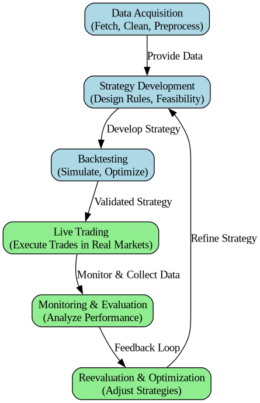

### Legacy Code Snippets

- Modular implementations of key trading components.
- Integration with APIs for data acquisition and live order execution.
- Strategy optimization methods with backtesting support.

### Extended Trading System Activity Diagram

A comprehensive visualization of the trading system's lifecycle, integrating backtesting, live trading, and continuous optimization workflows.

